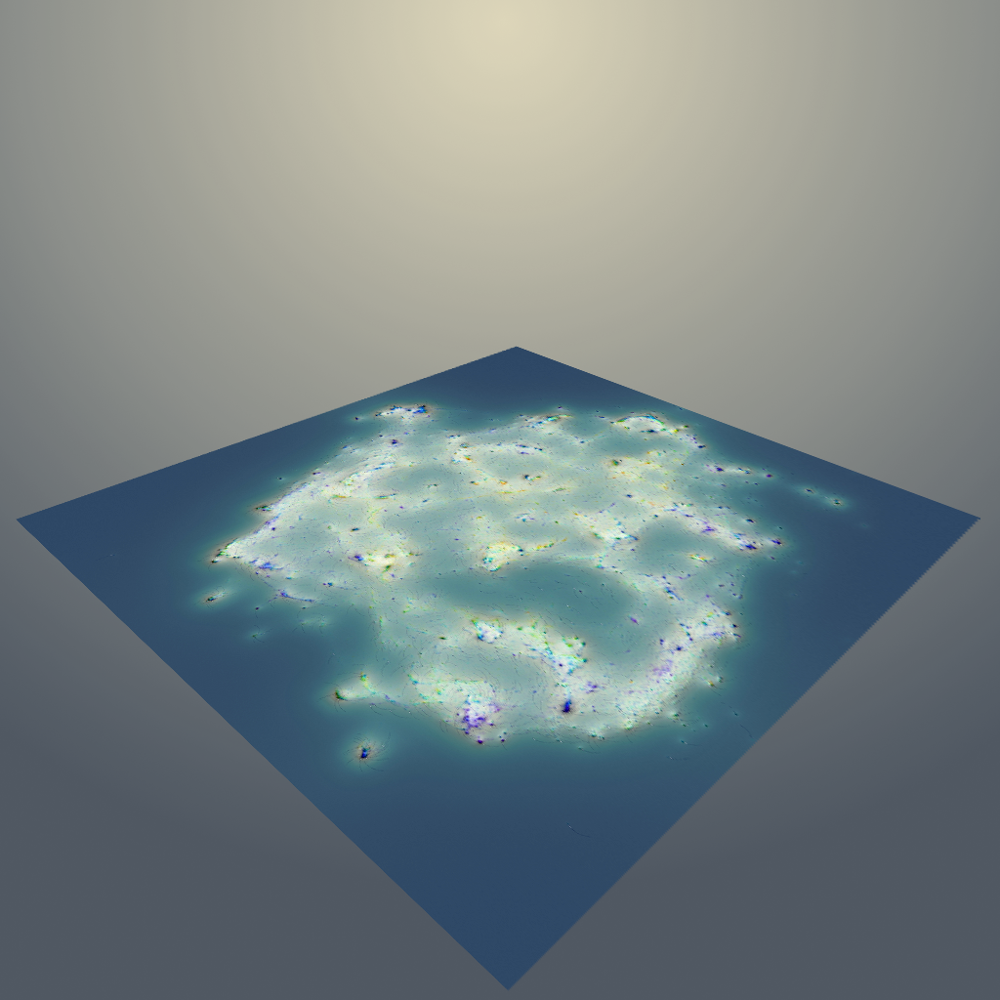

# Current status

We are in the process of printing the *Grounded AI Map*.
Upcoming: workshop with the Danish Technical Museum for a 2025 exhibition.

# Latest news

To do.

# About

## What is this project about?

To do.

## Who are we

A group of researchers from Aalborg University and the Danish Technical University.

In collaboration with: 

[AAU TantLab](https://www.en.culture.aau.dk/research/research-groups/tantlab)

[ECHO Lab - The Observatory for Human Centered Engineering]

[Dario Rodighiero](https://dariorodighiero.com) (University of Groningnen) 

[ADD (Algorithms, Data, and Democracy)](https://algorithms.dk)

## Sponsors

To do.

# Downloads

To do.

# Methodology

To do.

# Contact us

To do.

# Test

  <h2>I am testing here writing HTML within Markdown, as it should be possible.</h2>
  
Paragraph lorem ipsum dolor sit amet

  
Other paragraph with <strong>bold</strong>, <em>italic</em> etc.

  
Test with inline style

  
Test with an image: 

